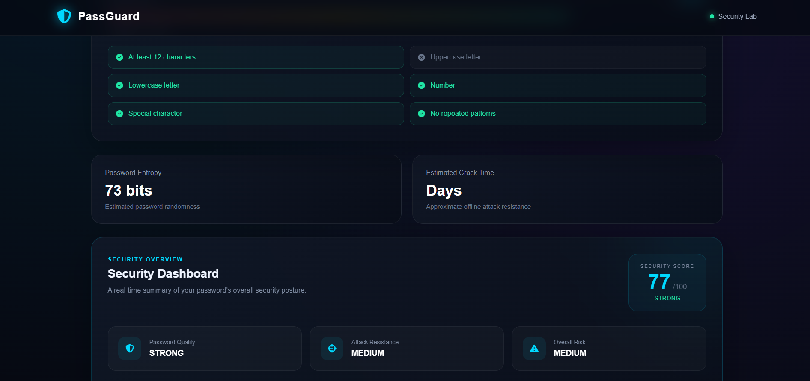
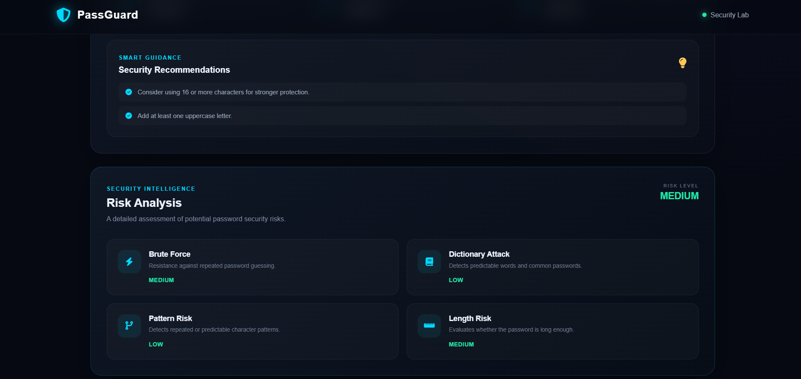
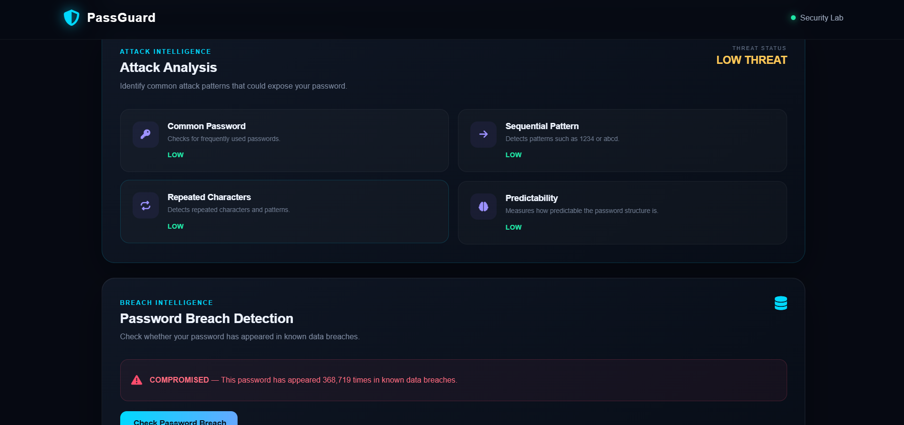
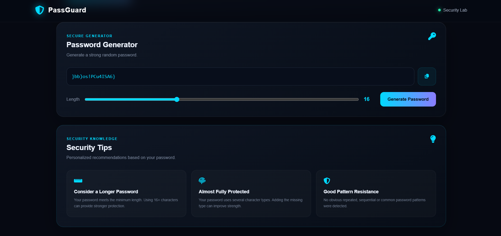

# 🔐 PassGuard — Password Security & Risk Analyzer

PassGuard is a modern web-based cybersecurity application designed to help users understand the strength and security of their passwords.

It analyzes password complexity, entropy, predictable patterns, attack risks, and compromised-password exposure. It also provides personalized security recommendations and a secure password generator.

---

## 🚀 Features

### 🔍 Password Strength Analysis

PassGuard evaluates passwords using multiple security criteria:

* Password length
* Uppercase letters
* Lowercase letters
* Numbers
* Special characters
* Repeated patterns
* Common password patterns
* Predictable sequences

The application provides a security score from **0 to 100**.

---

### 📊 Password Entropy

The analyzer calculates estimated password entropy in bits.

Entropy provides an indication of how difficult a password may be to guess based on its length and character space.

Example:

```text
Entropy: 72 bits
```

---

### 🛡️ Risk Analysis

PassGuard identifies possible security risks including:

* Brute-force attack risk
* Dictionary attack risk
* Predictable patterns
* Short passwords
* Repeated characters
* Common passwords

---

### ⚔️ Attack Analysis

The application evaluates password resistance against common attack techniques:

* Brute-force attacks
* Dictionary attacks
* Pattern-based attacks
* Sequential characters
* Repeated characters
* Predictable structures

---

### 🔎 Password Breach Detection

PassGuard can check whether a password has appeared in known data breaches using the **Have I Been Pwned Pwned Passwords API**.

For privacy, the application uses a **k-anonymity** approach:

1. The password is hashed locally.
2. Only the first 5 characters of the hash are sent for lookup.
3. The complete password is never sent to the API.
4. The matching hash suffix is checked locally.

---

### 🔐 Secure Password Generator

PassGuard includes a secure password generator using the browser's `crypto.getRandomValues()` API.

Users can generate passwords with:

* Uppercase letters
* Lowercase letters
* Numbers
* Special characters
* Custom password length

---

### 📈 Security Dashboard

The dashboard provides an overall view of password security, including:

* Security score
* Password quality
* Attack resistance
* Overall risk
* Security recommendations

---

### 💡 Smart Security Recommendations

PassGuard provides personalized recommendations based on the analyzed password.

Examples include:

* Use longer passwords
* Add more character types
* Avoid repeated characters
* Avoid predictable patterns
* Avoid commonly used passwords

---

## 📸 Project Screenshots

### 🔍 Password Analyzer


### 📊 Entropy & Crack Time



### 🛡️ Security Dashboard



### ⚔️ Attack Analysis & Breach Detection



### 🔐 Password Generator & Security Tips



---

## 🛠️ Technologies Used

* HTML5
* CSS3
* JavaScript
* Web Crypto API
* Have I Been Pwned Pwned Passwords API
* Font Awesome

---

## 📂 Project Structure

```text
PassGuard/
│
├── index.html
├── style.css
├── script.js
├── README.md
│
└── screenshots/
    ├── analyzer.png
    ├── entropy.png
    ├── dashboard.png
    ├── attack-breach.png
    └── generator-tips.png
```

---

## 🎯 Project Objective

PassGuard demonstrates practical concepts in:

* Cybersecurity
* Password security
* Cryptography
* Web development
* Risk analysis
* API integration
* Secure random generation
* Security awareness

---

## 🔒 Security & Privacy

Password analysis is performed locally in the browser.

For breach detection, PassGuard uses a partial password hash rather than sending the complete password to the breach-checking service.

---

## ⚠️ Disclaimer

PassGuard provides educational password-security estimates. Estimated crack time is only an approximation and can vary depending on hardware, attack methods, databases, rate limits, and other factors.
